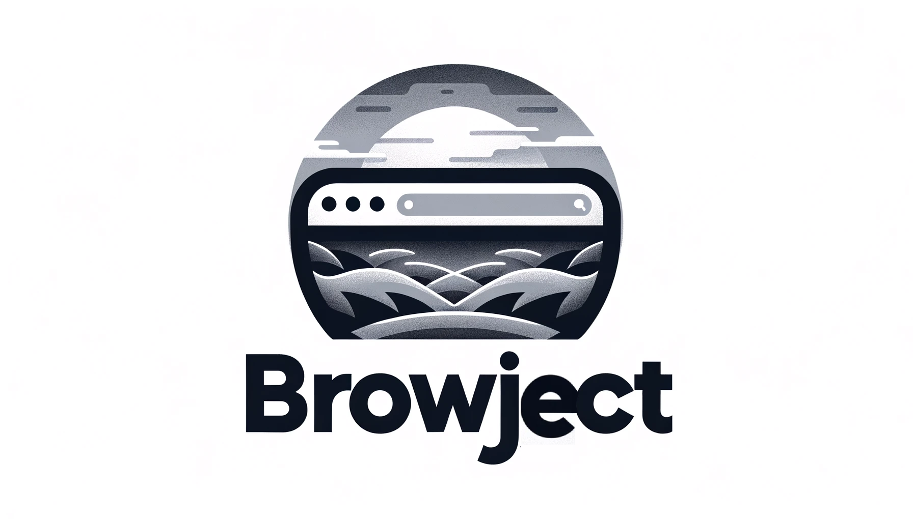

# BrowJect



BrowJect is a Python module to access and emulate various browser attributes, making it an ideal tool for reverse engineering antibots. The module is powered by [TakionAPI](https://takionapi.tech/), ensuring that the browser data is always up-to-date with any browser version/model/OS. 

Thanks to TakionAPI, the best antibot bypass API provider, the BrowJect database is continually updated. Consider joining their [Discord](https://takionapi.tech/discord) for a free trial.


## Table of Contents
- [BrowJect](#browject)
  - [Table of Contents](#table-of-contents)
  - [Supported Browsers and Operating Systems!](#supported-browsers-and-operating-systems)
  - [Features](#features)
  - [Installation](#installation)
  - [Usage](#usage)
    - [Attributes](#attributes)
    - [Examples](#examples)
      - [Load a random browser](#load-a-random-browser)
      - [Load a specific browser](#load-a-specific-browser)
    - [Parameters for loading a browser!](#parameters-for-loading-a-browser)
    - [Use Case: Reverse Engineering Antibots](#use-case-reverse-engineering-antibots)
  - [Special Thanks](#special-thanks)


## Supported Browsers and Operating Systems!
- **Operating Systems:** Windows, MacOS
- **Browsers:** 
  - Chrome (Versions 15 to 119)
  - Firefox (Versions 10 to 119)
  - Safari (Versions 5.1 to 17)
  - Edge (Versions 15 to 18 and 79 to 118)
  - Internet Explorer (Versions 7 to 11)
  - Brave (Versions 1.32 to 1.59)
  - Opera (Versions 20 to 103)

## Features

- **Dynamic Browser Loading:** Load any browser based on user agent, version, name or operating system. This allows for unmatched flexibility and precision in your interactions.
  
- **Up-to-date Browser Database:** Thanks to [TakionAPI](https://takionapi.tech/), BrowJect's database is always updated with any Chrome version, model, or OS. TakionAPI is the premier provider of antibot bypass APIs.

- **Easy to Use:** BrowJect provides a simple interface to fetch and work with browser attributes.

- **Ideal for Reverse Engineering:** Aid your reverse engineering efforts against antibots by directly accessing browser attributes in Python.

## Installation

Install BrowJect using pip:

```bash
pip install browject
```

## Usage

After installing, you can easily create a browser object based on user agent, version, or operating system, and then access its attributes.

### Attributes
  - `operatingSystem` - The operating system of the browser.
  - `browserName` - The name of the browser.
  - `browserVersion` - The version of the browser.
  - `browserVersionFull` - The full version of the browser.
  - `userAgent` - The user agent of the browser.
  - `timezone` - The timezone of the browser.
  - `navigator` - The navigator of the browser.
  - `screen` - The screen of the browser.
  - `window` - The window of the browser.
  - `document` - The document of the browser.
  - `sec_ch_ua` - The `Sec-CH-UA` header of the browser.
  - `sec_ch_ua_platform` - The `Sec-CH-UA-Platform` header of the browser.

### Examples

#### Load a random browser
```python
from browject import BrowJect

browser = BrowJect() # No parameters = random browser
print(browser.browserName)
```

#### Load a specific browser
```python
from browject import BrowJect, Chrome, Mac

browser = BrowJect(browser_name=Chrome, operating_system=Mac)
print(browser.browserName)
```

### Parameters for loading a browser!
When initializing the BrowJect class, you can provide:

- `user_agent` Desired user agent.
- `browser_version` Desired browser version.
- `browser_name` Desired browser name.
- `operating_system` Desired operating system.

If invalid or no parameters are provided, a random browser will be returned.

### Use Case: Reverse Engineering Antibots

When working on antibots, it's crucial to understand and replicate the exact behaviors and attributes of a browser. With BrowJect, this task becomes seamless. For instance, if an antibot checks for specific plugins or screen dimensions, you can access and use these attributes directly in Python:

```python
# Accessing browser plugins 
plugins = browser.navigator.plugins

# Checking screen dimensions 
screen_width = browser.screen.width
screen_height = browser.screen.height
```

This direct access significantly eases the process of replicating browser behaviors and aids in bypassing antibots.

## Special Thanks

A special shoutout to [TakionAPI](https://takionapi.tech/) - the best antibot bypass APIs provider. If you haven't tried them yet, you're missing out. Join their [Discord](https://takionapi.tech/discord) for a free trial!

Additionally, a massive thank you to the developer behind BrowJect, **glizzykingdreko**. You can find him on [Medium](https://medium.com/@glizzykingdreko), [GitHub](https://github.com/glizzykingdreko), and [Twitter](https://twitter.com/glizzykingdreko). For any inquiries, reach out via email: glizzykingdreko@protonmail.com.